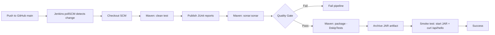

# CI Pipeline: Spring Boot + Jenkins + Maven + SonarQube (WSL)

Repo: https://github.com/JuanArep/test-jenkins.git

This repository demonstrates a CI pipeline that builds, tests, analyzes, packages, and smoke-tests a Spring Boot application using Jenkins, Maven, and SonarQube on a local WSL environment.

## What this pipeline does

On every change to the main branch (detected via Jenkins polling), the pipeline:

1. Checks out code from GitHub

2. Runs unit tests (mvn clean test)

3. Publishes JUnit test results in Jenkins

4. Runs SonarQube static analysis (mvn sonar:sonar)

5. Enforces SonarQube Quality Gate (waitForQualityGate)

6. Packages an executable Spring Boot JAR (mvn package -DskipTests)

7. Archives the JAR as a Jenkins build artifact

8. Runs a smoke test by starting the JAR and calling GET /api/hello

## Architecture / workflow

  
## Repo structure (key files)

1. Jenkinsfile — Jenkins pipeline definition (“Pipeline as Code”)

2. pom.xml — Maven build definition (dependencies + plugins)

3. src/main/java/... — Spring Boot application source

4. src/test/java/... — Unit tests

## Local run (developer workflow)

Prerequisites:
- Java 17
- Maven

Run unit tests:
``mvn clean test``

Package the app:
``mvn clean package -DskipTests``

Run the packaged app:
``java -jar target/demo-0.0.1-SNAPSHOT.jar --server.port=8081``

Smoke check the endpoint

In another terminal:
``curl -fsS http://localhost:8081/api/hello``

Expected output:
``hello``

## Jenkins pipeline stages

1) Checkout SCM
Jenkins clones this repo into its workspace.

2) Build & Unit Test
Runs:
``mvn -B clean test``

Publishes test results from:

target/surefire-reports/*.xml

3) SonarQube Scan
Runs:
``mvn -B sonar:sonar ...``

Uploads analysis results to SonarQube.

4) Quality Gate
Runs:
``waitForQualityGate abortPipeline: true``

Pipeline fails if the quality gate fails.

5) Package
Runs:
``mvn -B clean package -DskipTests``

Produces an executable Spring Boot JAR under target/.

6) Archive Artifact
Archives:
``target/*.jar``

So the build output can be downloaded from Jenkins.

7) Smoke Test
Starts the JAR on port 8081
Polls GET /api/hello until it responds with hello (or times out)
Stops the process and archives app.log

## Jenkinsfile configuration (exact values)

1) Trigger

``Mode: pollSCM('H/2 * * * *')``

Meaning: Jenkins polls GitHub roughly every 2 minutes and triggers a build when main changes.

2) Environment variables

``SONAR_PROJECT_KEY = "my-spring-ci"``

Used as the SonarQube project identifier for analysis results.

``SONAR_HOST_URL = "http://localhost:9000"``

Fallback SonarQube URL if withSonarQubeEnv('sonarqube') is not available.

3) SonarQube integration behavior

Preferred path: withSonarQubeEnv('sonarqube') (uses Jenkins global SonarQube server config + token).

Fallback path: runs mvn sonar:sonar with -Dsonar.host.url=${SONAR_HOST_URL}.

Quality Gate enforcement: waitForQualityGate abortPipeline: true with a 5-minute timeout.

4) Packaging output

Expected artifact location: target/*.jar

Jenkins archives the jar and fingerprints it:

archiveArtifacts artifacts: 'target/*.jar', fingerprint: true

5) Smoke test parameters

Port: 8081 (avoids conflict with Jenkins on 8080)

Endpoint: GET /api/hello must return hello

Retry policy: up to 30 attempts with 2s sleep (≈ 60 seconds max)

Logs: archives app.log from the smoke test stage for troubleshooting

## SonarQube setup notes (local WSL + Docker)

SonarQube runs in Docker and Jenkins runs on the WSL host. For reliable Quality Gate behavior, configure a SonarQube webhook back to Jenkins.

Example webhook URL:

``http://172.17.0.1:8080/sonarqube-webhook/``

(Where 172.17.0.1 is typically the WSL host’s docker0 bridge IP.)

Trigger model (why pollSCM)

This setup uses Jenkins pollSCM instead of GitHub webhooks because Jenkins is hosted locally (WSL) and is not reachable from the public internet. Polling provides a simple “build on main change” mechanism for a local learning environment.

